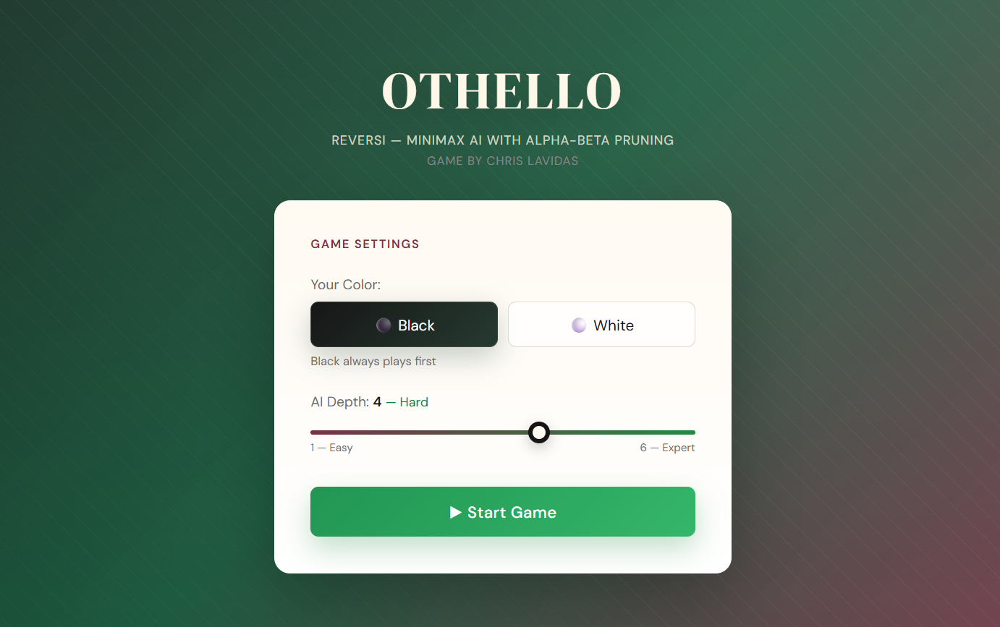
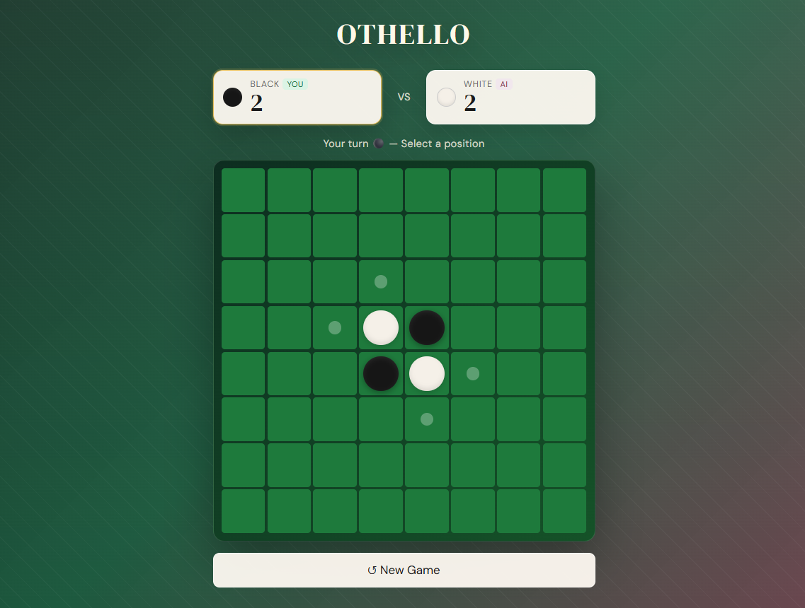

# Othello: Reversi

#### Game by Chris Lavidas

*Artificial Intelligence assignment, 5th semester, Department of Informatics, AUEB*

A Python implementation of **Othello (Reversi)** where a human plays against an AI opponent. The AI uses the **Minimax algorithm with Alpha-Beta Pruning** to search for the best move at each turn, with a selectable search depth from 1 (easy) to 6 (expert). The project is split into a Python/FastAPI backend that handles all game logic and AI computation, and a React frontend that runs in the browser. They communicate through a REST API. The board evaluation uses multiple heuristics (positional weights, mobility, frontier discs, and piece difference) combined in a multi-phase strategy that adapts depending on whether the game is in the early, mid, or end stage.

## Screenshots

### Game settings
Pick your color and the AI search depth (1 = Easy, 6 = Expert) before starting.



### In game
Live score, your-turn indicator, and the board with legal moves highlighted.



## Technology

- **Backend**: Python, FastAPI, Uvicorn
- **Frontend**: React
- **Algorithm**: Minimax + Alpha-Beta Pruning
- **Heuristics**: Positional weights, Mobility, Frontier discs, Piece difference

## Getting Started

```bash
# Backend
cd backend
pip install fastapi uvicorn pydantic
python -m uvicorn server:app --reload --port 8000

# Frontend (new terminal)
cd frontend
npm install
npm start
```
